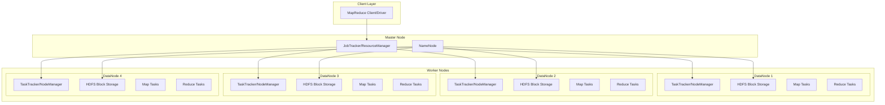
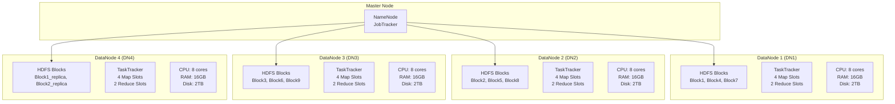
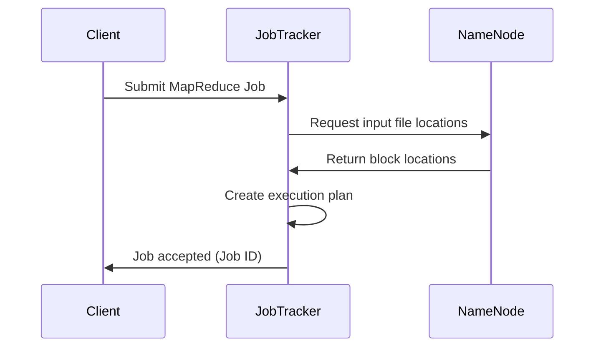
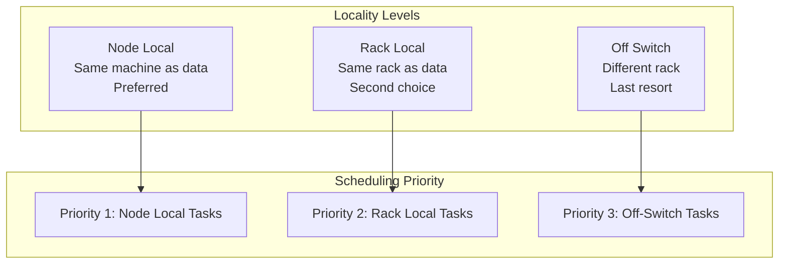
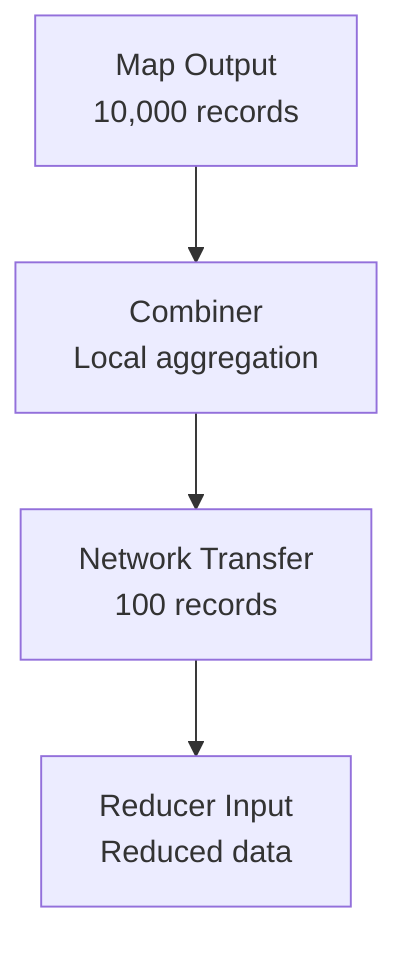

# 🏗️ **MapReduce Production Architecture & Cluster Operations**

---

## 📋 **Table of Contents**
1. [MapReduce Overview](#mapreduce-overview)
2. [Production Architecture](#production-architecture)
3. [Cluster Architecture](#cluster-architecture)
4. [Parallel Processing Model](#parallel-processing-model)
5. [Complete Workflow](#complete-workflow)
6. [Production Considerations](#production-considerations)
7. [Performance Optimization](#performance-optimization)

---

## 🔷 **MapReduce Overview**

**MapReduce** is a distributed computing framework designed for processing large datasets across clusters of commodity hardware with built-in fault tolerance and automatic parallelization.

### **Core Principles**
- **Divide & Conquer**: Break large problems into smaller, parallel tasks
- **Move Code to Data**: Process data locally where it's stored
- **Fault Tolerance**: Automatic recovery from hardware failures
- **Scalability**: Linear scaling with cluster size

---

## 🏛️ **Production Architecture**

### **High-Level Architecture Components**



### **Key Components**

| Component | Role | Production Considerations |
|-----------|------|--------------------------|
| **JobTracker/ResourceManager** | Job scheduling, resource allocation, monitoring | Single point of failure - requires HA setup |
| **TaskTracker/NodeManager** | Task execution, resource management per node | Memory and CPU allocation critical |
| **NameNode** | HDFS metadata management | Requires HA configuration and backup |
| **DataNode** | Data storage and local computation | Storage capacity and I/O throughput critical |

---

## 🌐 **Cluster Architecture**

### **4-Node Cluster Example: DN1, DN2, DN3, DN4**



### **Data Distribution & Replication**

**Input File**: 1GB file split into 9 blocks (128MB each)
- **Block 1**: DN1 (primary), DN4 (replica), DN2 (replica)
- **Block 2**: DN2 (primary), DN4 (replica), DN3 (replica)
- **Block 3**: DN3 (primary), DN1 (replica), DN2 (replica)
- And so on...

---

## ⚡ **Parallel Processing Model**

### **Map Phase Parallelism**

```mermaid
gantt
    title Map Task Execution Timeline
    dateFormat X
    axisFormat %L
    
    section DN1
    Map Task 1    :0, 100
    Map Task 2    :0, 120
    Map Task 3    :50, 150
    
    section DN2
    Map Task 4    :0, 110
    Map Task 5    :0, 130
    
    section DN3
    Map Task 6    :0, 105
    Map Task 7    :40, 140
    
    section DN4
    Map Task 8    :0, 115
    Map Task 9    :20, 125
```



### **Resource Allocation Per Node**

| Node | Map Slots | Reduce Slots | Memory per Task | CPU Cores |
|------|-----------|--------------|-----------------|-----------|
| DN1  | 4         | 2            | 1GB            | 2         |
| DN2  | 4         | 2            | 1GB            | 2         |
| DN3  | 4         | 2            | 1GB            | 2         |
| DN4  | 4         | 2            | 1GB            | 2         |

**Total Cluster Capacity**: 16 Map slots, 8 Reduce slots

---

## 🔄 **Complete Workflow**

### **Phase 1: Job Submission & Planning**



### **Phase 2: Map Task Execution**

```mermaid
graph TD
    subgraph "Input Splitting"
        INPUT[Input File 1GB]
        SPLIT1[Block1 - 128MB]
        SPLIT2[Block2 - 128MB]
        SPLIT3[Block3 - 128MB]
        SPLITN[Block9 - 128MB]
        
        INPUT --> SPLIT1
        INPUT --> SPLIT2
        INPUT --> SPLIT3
        INPUT --> SPLITN
    end
    
    subgraph "Map Execution on DN1"
        SPLIT1 --> MAP1[Map Task 1<br/>Process Block1]
        MAP1 --> OUT1[Intermediate Output<br/>key1: [val1, val2]<br/>key2: [val3]]
    end
    
    subgraph "Map Execution on DN2"
        SPLIT2 --> MAP2[Map Task 2<br/>Process Block2]
        MAP2 --> OUT2[Intermediate Output<br/>key1: [val4]<br/>key3: [val5, val6]]
    end
    
    subgraph "Map Execution on DN3"
        SPLIT3 --> MAP3[Map Task 3<br/>Process Block3]
        MAP3 --> OUT3[Intermediate Output<br/>key2: [val7]<br/>key3: [val8]]
    end
```

### **Phase 3: Shuffle & Sort**

```mermaid
graph TD
    subgraph "Map Outputs"
        M1[DN1: key1:[v1,v2], key2:[v3]]
        M2[DN2: key1:[v4], key3:[v5,v6]]
        M3[DN3: key2:[v7], key3:[v8]]
    end
    
    subgraph "Partitioning & Transfer"
        PART[Partitioner<br/>Hash(key) % num_reducers]
        
        M1 --> PART
        M2 --> PART
        M3 --> PART
    end
    
    subgraph "Reducer Inputs"
        R1[Reducer 1<br/>key1: [v1,v2,v4]<br/>key2: [v3,v7]]
        R2[Reducer 2<br/>key3: [v5,v6,v8]]
        
        PART --> R1
        PART --> R2
    end
```

### **Phase 4: Reduce Execution**

```mermaid
graph TD
    subgraph "Reduce Phase on DN1"
        R1_IN[key1: [v1,v2,v4]<br/>key2: [v3,v7]]
        R1_PROC[Reduce Function<br/>Aggregate values]
        R1_OUT[key1: result1<br/>key2: result2]
        
        R1_IN --> R1_PROC --> R1_OUT
    end
    
    subgraph "Reduce Phase on DN2"
        R2_IN[key3: [v5,v6,v8]]
        R2_PROC[Reduce Function<br/>Aggregate values]
        R2_OUT[key3: result3]
        
        R2_IN --> R2_PROC --> R2_OUT
    end
    
    subgraph "Final Output"
        HDFS_OUT[HDFS Output Directory<br/>part-r-00000: key1: result1, key2: result2<br/>part-r-00001: key3: result3]
        
        R1_OUT --> HDFS_OUT
        R2_OUT --> HDFS_OUT
    end
```

---

## 🏭 **Production Considerations**

### **1. Resource Management**

#### **Memory Configuration**
```
# Heap size for Map tasks
mapreduce.map.java.opts=-Xmx1024m

# Heap size for Reduce tasks  
mapreduce.reduce.java.opts=-Xmx2048m

# Container memory
yarn.scheduler.maximum-allocation-mb=8192
```

#### **CPU Allocation**
```
# Virtual cores per container
yarn.scheduler.maximum-allocation-vcores=4

# Map task CPU
mapreduce.map.cpu.vcores=1

# Reduce task CPU
mapreduce.reduce.cpu.vcores=2
```

### **2. Fault Tolerance Mechanisms**

| Failure Type | Detection | Recovery Mechanism |
|--------------|-----------|-------------------|
| **Map Task Failure** | TaskTracker heartbeat timeout | Restart task on different node |
| **Reduce Task Failure** | TaskTracker heartbeat timeout | Restart task, re-fetch map outputs |
| **DataNode Failure** | NameNode heartbeat timeout | Use replica blocks, reschedule tasks |
| **TaskTracker Failure** | JobTracker heartbeat timeout | Reschedule all running tasks |

### **3. Data Locality Optimization**



### **4. Performance Tuning Parameters**

#### **Map Phase Tuning**
```properties
# Number of map tasks per job
mapreduce.job.maps=16

# Map output compression
mapreduce.map.output.compress=true
mapreduce.map.output.compress.codec=org.apache.hadoop.io.compress.SnappyCodec

# Sort buffer size
mapreduce.task.io.sort.mb=256

# Spill threshold
mapreduce.map.sort.spill.percent=0.8
```

#### **Reduce Phase Tuning**
```properties
# Number of reduce tasks
mapreduce.job.reduces=8

# Shuffle buffer size
mapreduce.reduce.shuffle.input.buffer.percent=0.7

# Merge threshold
mapreduce.reduce.shuffle.merge.percent=0.66

# Reduce buffer size
mapreduce.reduce.input.buffer.percent=0.0
```

### **5. Monitoring & Metrics**

#### **Key Performance Metrics**
- **Job Execution Time**: Total time from submission to completion
- **Map Task Duration**: Average time per map task
- **Shuffle Time**: Time spent transferring intermediate data
- **Reduce Task Duration**: Average time per reduce task
- **Data Locality Ratio**: Percentage of node-local tasks
- **Cluster Utilization**: Resource usage across nodes

#### **Production Monitoring Dashboard**
```
📊 Cluster Status:
├── Active Nodes: 4/4
├── Running Jobs: 3
├── Queue Utilization: 75%
├── HDFS Usage: 2.1TB/8TB (26%)
└── Average Job Time: 12.5 minutes

🔧 Resource Allocation:
├── Map Slots Used: 12/16 (75%)
├── Reduce Slots Used: 6/8 (75%)
├── Memory Usage: 48GB/64GB (75%)
└── CPU Usage: 24/32 cores (75%)
```

---

## 🚀 **Performance Optimization**

### **1. Input Split Optimization**
- **Optimal Split Size**: 128MB-256MB per split
- **Avoid Small Files**: Combine small files using CombineFileInputFormat
- **Custom Input Formats**: For specialized data formats

### **2. Combiner Usage**


### **3. Partitioning Strategy**
```java
// Custom Partitioner for better load balancing
public class CustomPartitioner extends Partitioner<Key, Value> {
    @Override
    public int getPartition(Key key, Value value, int numPartitions) {
        // Custom logic to distribute keys evenly
        return (key.hashCode() & Integer.MAX_VALUE) % numPartitions;
    }
}
```

### **4. Memory & I/O Optimization**
- **Compression**: Use Snappy/LZ4 for intermediate data
- **Serialization**: Use efficient serialization formats (Avro, Parquet)
- **Buffer Sizes**: Tune sort and shuffle buffer sizes
- **Spill Management**: Optimize spill frequency and merge operations

---

## 📈 **Scalability Patterns**

### **Horizontal Scaling**
```
2 Nodes → 4 Nodes → 8 Nodes → 16 Nodes
├── Linear throughput increase
├── Maintain data locality
├── Network bandwidth considerations
└── Rack-aware placement
```

### **Vertical Scaling**
```
Node Specifications:
├── CPU: 8 → 16 → 32 cores
├── RAM: 16GB → 32GB → 64GB
├── Storage: 2TB → 4TB → 8TB
└── Network: 1Gbps → 10Gbps
```

---

## 🔒 **Production Checklist**

### **Pre-Production**
- [ ] High Availability setup for NameNode/JobTracker
- [ ] Backup and disaster recovery procedures
- [ ] Security configuration (Kerberos, SSL)
- [ ] Resource quotas and fair scheduling
- [ ] Monitoring and alerting setup

### **Runtime**
- [ ] Job queue management
- [ ] Resource utilization monitoring
- [ ] Performance bottleneck identification
- [ ] Failure recovery testing
- [ ] Capacity planning and scaling

### **Post-Production**
- [ ] Log analysis and cleanup
- [ ] Performance metrics analysis
- [ ] Capacity utilization reports
- [ ] Cost optimization recommendations
- [ ] System health assessments

---

This comprehensive guide covers all production-level aspects of MapReduce implementation in a distributed cluster environment, providing the foundation for scalable big data processing solutions.