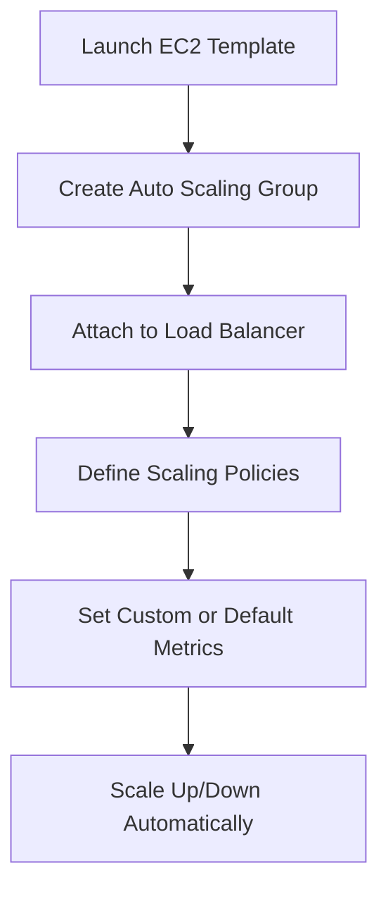

Here's a **well-structured and professionally formatted documentation** for your notes, organized under clear headings with definitions, flow diagrams (conceptually), and clarified explanations.

---

# 📘 AWS EC2 and Core Infrastructure Concepts – Technical Overview

## 🔧 1. **EC2 Console Overview**

* **Amazon EC2 (Elastic Compute Cloud)** is a web service that provides secure, resizable compute capacity in the cloud.
* The **EC2 Console** is the GUI interface on AWS Management Console where you can:

  * Launch, manage, monitor instances.
  * Configure auto scaling, storage, and network settings.

---

## 🧰 2. **Underlying Hypervisor Technology**

* **Hypervisor**: Software layer between physical hardware and virtual machines.
* Two main hypervisors used by AWS:

  * **Xen**: Legacy hypervisor for EC2.
  * **KVM (Kernel-based Virtual Machine)**: Modern, higher performance, better isolation.

> 🔽 **All operations happen above the hypervisor layer**.

---

## 🛠️ 3. **Core Resources in EC2 Instances**

| Resource Type  | Examples                           |
| -------------- | ---------------------------------- |
| **CPU**        | Intel Xeon, AMD EPYC, ARM Graviton |
| **Memory**     | RAM (DDR4, DDR5)                   |
| **Storage**    | HDD, SSD (EBS / Instance Store)    |
| **Networking** | NIC, ENI, VPC, Security Groups     |

---

## 🖥️ 4. **Compute Layer**

* **Instance Types**: t2.micro, m5.large, c6g.xlarge, etc.
* **CPU Instruction Sets**:

  * **x86-64**: Used in Intel/AMD.
  * **ARM**: Used in AWS Graviton processors (better price/performance).

---

## 💾 5. **Storage Types in AWS**

| Storage Type                    | Description                            |
| ------------------------------- | -------------------------------------- |
| **EBS (Elastic Block Store)**   | Persistent block storage (SSD/HDD)     |
| **Instance Store**              | Ephemeral, physically attached storage |
| **S3 (Simple Storage Service)** | Scalable object storage                |
| **EFS (Elastic File System)**   | Shared file storage over NFS           |

> ❗ **Which is faster?**

* **Instance Store > EBS SSD > EBS HDD** (in raw performance).
* Instance Store is fastest but **non-persistent**.

---

## 🧠 6. **Memory Layer**

* EC2 Memory is **RAM** attached to the instance.
* Determines in-memory performance, cache capacity, and execution speed.

---

## 🌐 7. **Networking Layer**

| Component                           | Description                        |
| ----------------------------------- | ---------------------------------- |
| **VPC**                             | Isolated cloud network environment |
| **Security Group**                  | Virtual firewall for instances     |
| **ENI (Elastic Network Interface)** | Virtual network card               |
| **Elastic IP**                      | Static public IP for EC2           |
| **High Network Performance**        | Use Placement Groups (Clustered)   |

---

## 🚀 8. **Auto Scaling – Mandatory?**

* **Not mandatory**, but **highly recommended** for:

  * High availability.
  * Cost optimization.
  * Load balancing.

> 🔁 **Auto Scaling Flow**:

1. Monitor metrics via CloudWatch.
2. Define policies to launch/terminate instances.
3. Scale-in or Scale-out automatically based on traffic.

---

## 🏢 9. **Physical Machine and Hypervisor**

* AWS hosts multiple EC2 instances on a **physical machine**.
* Hypervisor allocates compute and network resources.
* Admin users (Linux/Hadoop Admins) **should not terminate core EC2s** without plan.

---

## 📂 10. **DAS vs EFS**

| Feature    | DAS (Direct Attached Storage)       | EFS (Elastic File System)       |
| ---------- | ----------------------------------- | ------------------------------- |
| Type       | Local storage (like Instance Store) | Network-attached shared storage |
| Scope      | Single instance                     | Multiple instances              |
| Durability | Low                                 | High                            |
| Use Case   | Temporary, fast access              | Shared file system access       |

---

## 💸 11. **Spot vs On-Demand Instances**

| Type                | Description                                               |
| ------------------- | --------------------------------------------------------- |
| **Spot**            | Spare capacity at up to 90% discount. Terminated anytime. |
| **On-Demand**       | Fixed pricing, runs until you stop. Reliable.             |
| **Reserved**        | 1-3 year contract for cost savings.                       |
| **Use Case (Spot)** | Batch jobs, data processing, flexible workloads.          |

> Use **Spot Instances** to reduce cost but not for critical long-running services.

---

## 📈 12. **Current AWS Instance Pricing**

* Refer official pricing: [AWS EC2 Pricing](https://aws.amazon.com/ec2/pricing/)
* Pricing depends on:

  * Instance type (e.g., t4g.micro vs m6a.large)
  * Region
  * OS
  * Storage type

---

## 📡 13. **High Network Performance**

* Use **Placement Groups (Cluster)** for:

  * **Low latency**
  * **High throughput**
  * **Instances on same rack**

> ✅ Best practice:

* Use **same AZ**, **same rack**, or **partition placement group**.

---

## 🗃️ 14. **Cluster, AZ, Rack Concepts**

| Concept                    | Description                                           |
| -------------------------- | ----------------------------------------------------- |
| **Cluster**                | Group of EC2s with low-latency network in a single AZ |
| **AZ (Availability Zone)** | Isolated data center inside AWS Region                |
| **Rack**                   | Physical hardware rack inside AZ                      |

* **Different Racks = Low risk of failure**
* **Different AZs = Fault Tolerance**
* **Same Rack = High Performance**

---

## 📦 15. **Rack Partitioning and Control**

* AWS provides **Partition Placement Group**:

  * 1 Partition = 1 rack
  * Spread instance across **different partitions** = fault isolation
  * Use in **Hadoop, Cassandra, Kafka** setups

---

## ✅ 16. **Best Practices Summary**

| Requirement           | Solution                              |
| --------------------- | ------------------------------------- |
| High performance      | Cluster Placement Group               |
| High availability     | Use Auto Scaling + Multi-AZ           |
| Low rack failure risk | Partition Placement Group             |
| Cost-saving           | Spot Instances + Reserved             |
| High storage IOPS     | Use **EBS io2** or **Instance Store** |
| File sharing          | EFS or FSx                            |

---


---

## 🔐 1. **AWS Resource Access – Capacity Reservation & IAM Design**

### 📦 Capacity Reservation Group (CRG)

* **Purpose**: Reserve EC2 capacity in a specific AZ for high availability or special workloads (e.g., disaster recovery).
* **Use Case**:

  * Ensure compute capacity in busy regions
  * Meet compliance or tenancy requirements

### 🔁 Flow:

```text
User → IAM Group → IAM Role → AWS Services (with Policies)
```

### 👥 IAM Users & Groups:

| Group      | Users   | Purpose             |
| ---------- | ------- | ------------------- |
| Developers | 3 Devs  | EC2, S3, Lambda Dev |
| Operations | 2 Ops   | Monitor, maintain   |
| Auditors   | 1 Audit | Read-only access    |

---

## 🎯 2. **Permissions Setup**

### ✅ Developer Permissions

* Launch/terminate EC2
* Read/write to S3
* View logs (CloudWatch)
* Access APIs

### ✅ Audit Role Permissions

* Read-only for all services
* List buckets, describe EC2

### ✅ Operations Role

* Restart EC2, attach volumes
* Monitor logs, access CloudWatch alarms

### 🔐 IAM Actions Examples

| Task              | IAM Permission          |
| ----------------- | ----------------------- |
| Read S3 file      | `s3:GetObject`          |
| Add user to group | `iam:AddUserToGroup`    |
| Create role       | `iam:CreateRole`        |
| Read EC2 details  | `ec2:DescribeInstances` |

---

## 🧾 3. **Policies and API Access**

* **AWS-managed policies** simplify admin work.
* You can attach:

  * **Prebuilt Policies** (e.g., `AmazonS3ReadOnlyAccess`)
  * **Custom Policies** (JSON defined)

### 🧩 Example S3 Read-Only Policy:

```json
{
  "Effect": "Allow",
  "Action": ["s3:GetObject"],
  "Resource": "arn:aws:s3:::example-bucket/*"
}
```

### 🔄 API Calls (S3 Bucket):

* Use `GET`, `PUT`, `DELETE`, `LIST` via SDK/CLI
* Example:

```bash
aws s3 cp s3://mybucket/file.txt .
```

---

## ⚙️ 4. **Configure EC2 Instance – All Steps Explained**

1. **Choose AMI** – Select Linux/Windows image
2. **Choose Instance Type** – (e.g., t2.micro)
3. **Configure Instance Details**:

   * VPC/Subnet
   * Auto-assign public IP
   * Tenancy: Shared / Dedicated / Host
4. **Add Storage** – EBS Volume
5. **Add Tags** – Name, Owner, Project
6. **Configure Security Group** – Allow HTTP/SSH
7. **Key Pair** – Select/create PEM file

---

## 🧠 5. **Linux Concepts**

### 📁 What is `/ram` Folder?

* Possibly custom or RAMDisk mount folder.
* Not standard in Linux. Tempfs mounts typically go to `/tmp` or `/dev/shm`.

---

## 🏠 6. **EC2 Tenancy – Types & Use Cases**

| Tenancy Type  | Description                    | Use Case           |
| ------------- | ------------------------------ | ------------------ |
| **Shared**    | Default, low cost              | General apps       |
| **Dedicated** | One tenant per physical server | Compliance         |
| **Host**      | Full control of server         | License-bound apps |

---

## ⚠️ 7. **Limitations**

| Component          | Limitations                            |
| ------------------ | -------------------------------------- |
| **Instance Store** | Non-persistent, lost on stop/terminate |
| **EBS**            | Max 64 TiB, AZ-bound                   |
| **EFS**            | Shared FS, requires NFS client         |

---

## 📂 8. **Storage Deep Dive**

### 📦 Types of AWS Storage:

| Type               | Description    | Suitable for            |
| ------------------ | -------------- | ----------------------- |
| **S3**             | Object Storage | Backup, static content  |
| **EBS**            | Block Storage  | EC2 root & data volumes |
| **EFS**            | File Storage   | Shared file systems     |
| **Instance Store** | Ephemeral      | Temp caching            |

### EFS vs NAS:

* EFS is **similar to NAS**, but fully managed and elastic.
* Scales across **multiple AZs and instances**.

---

## 🧾 9. **Bash Scripts – Linux**

* **Bash script**: A text file containing shell commands executed in order.
* Used to automate tasks like software install, config, backups, etc.

```bash
#!/bin/bash
sudo yum update -y
sudo systemctl start httpd
```

---

## 🔐 10. **SSL/TLS Setup Steps**

1. Buy or create certificate (AWS ACM or Let's Encrypt)
2. Attach certificate to **ALB** or **CloudFront**
3. Enforce HTTPS redirection in EC2/Apache/Nginx
4. Enable TLS 1.2+ and disable insecure ciphers
5. Test via SSL Labs or `openssl s_client`

---

## 🌐 11. **Load Balancer in AWS**

### 📘 What is Load Balancer?

* Distributes incoming traffic across multiple targets (EC2s, containers).
* Increases **availability**, **reduces downtime**.

### 🧱 Types of Load Balancers:

| Type              | Use Case           |
| ----------------- | ------------------ |
| **ALB** (App LB)  | HTTP/HTTPS traffic |
| **NLB** (Net LB)  | TCP/UDP traffic    |
| **CLB** (Classic) | Legacy systems     |

---

### 🔄 Load Balancer Function Flow:

```text
Client Request → Load Balancer → Healthy EC2 → Response Back
```

### Key Concepts:

* **Health Check**: LB pings targets (EC2) to ensure they’re healthy.
* **Sticky Sessions**: Route same client to same server (optional).
* **High Availability**: Spread across AZs.

---

## 🔐 12. **Authentication Across Servers**

If your website is on **3 servers**, use:

1. **Load Balancer (ALB)**
2. **Sticky Sessions (if needed)**
3. **Central Auth Service** (e.g., Cognito, Keycloak)
4. **Sessions/Token in DB or Redis** for sync

---

## 📊 13. **How Load Balancer Tracks Requests**

* Uses **Connection Table** internally.
* Based on:

  * Source IP + Port
  * Session cookie (if sticky)
  * TLS handshake
* Logs are stored in **CloudWatch Logs**

---

## 🧠 14. **High Availability Setup**

* Use:

  * Multi-AZ deployment
  * Auto Scaling Group
  * Health Checks
  * Load Balancer in front
  * S3 + RDS + EFS (multi-AZ services)

---

## ⚙️ 15. **Is Load Balancer Fully Managed?**

✅ Yes, AWS Load Balancer is fully managed, but you must:

1. Create LB (ALB/NLB)
2. Register targets (EC2)
3. Configure listeners (ports/protocols)
4. Set health checks
5. Set security group rules

---
---

# 📘 AWS EC2 + Load Balancer Setup Guide with WAF/Shield & DDoS Protection

---

## 🚀 1. **Configure EC2 Instance – Step-by-Step**

### ✅ Steps:

1. **Launch Instance** → Choose AMI (Amazon Linux, Ubuntu)
2. **Select Instance Type** → e.g., t2.micro, t3.medium
3. **Configure Instance Details**:

   * Number of instances
   * Network: Select VPC
   * Subnet: Choose AZ
   * Auto-assign Public IP: Enabled
   * IAM Role (if needed)
   * Tenancy: Shared/Dedicated
4. **Add Storage**:

   * EBS SSD volume (default root: `/dev/xvda`)
   * Add more volumes if needed
5. **Add Tags** (optional):

   * `Key = Name`, `Value = MyApp-Server`
6. **Configure Security Group**:

   * Create new or use existing SG
   * Add inbound & outbound rules (explained below)
7. **Select Key Pair**:

   * Create new key pair or use existing `.pem` file

---

## 🔐 2. **Security Group – Inbound & Outbound Rules**

### 🛡️ Inbound Rules (Allow traffic **to** your instance)

| Protocol | Port | Source                     | Description        |
| -------- | ---- | -------------------------- | ------------------ |
| SSH      | 22   | Your IP (e.g. 10.0.0.1/32) | Admin access       |
| HTTP     | 80   | 0.0.0.0/0                  | Public web traffic |
| HTTPS    | 443  | 0.0.0.0/0                  | Secure traffic     |

### 🌐 Outbound Rules (Allow traffic **from** your instance)

| Protocol | Port Range | Destination | Description           |
| -------- | ---------- | ----------- | --------------------- |
| All      | All        | 0.0.0.0/0   | Allow internet access |

> ✅ **Best Practice**: Restrict ports, avoid `All` if not needed.

---

## ⚖️ 3. **Types of AWS Load Balancers – Detailed Comparison**

| Load Balancer                       | Protocols         | Use Case                                      |
| ----------------------------------- | ----------------- | --------------------------------------------- |
| **ALB (Application Load Balancer)** | HTTP/HTTPS        | Web apps, REST APIs, host/path routing        |
| **NLB (Network Load Balancer)**     | TCP, UDP          | High performance, low latency (gaming, video) |
| **CLB (Classic Load Balancer)**     | HTTP, TCP         | Legacy apps (not recommended for new use)     |
| **GWLB (Gateway Load Balancer)**    | All (transparent) | Integrating third-party firewalls, IDS/IPS    |

---

## 🔧 4. **Create Load Balancer – Step-by-Step (for ALB)**

### 1️⃣ Step 1: Choose Load Balancer Type

* Go to EC2 → Load Balancers → Create Load Balancer
* Select **Application Load Balancer**

### 2️⃣ Step 2: Basic Configuration

* Name: `my-app-alb`
* Scheme: Internet-facing or Internal
* IP Type: IPv4 / Dualstack

### 3️⃣ Step 3: Listeners

* Default: `HTTP (80)` or `HTTPS (443)` with ACM certificate

### 4️⃣ Step 4: Availability Zones

* Select VPC
* Choose subnets in **2 or more AZs**

### 5️⃣ Step 5: Security Groups

* Attach existing or create new SG

  * Allow **HTTP(80)** and/or **HTTPS(443)**

### 6️⃣ Step 6: Target Group

* Create new target group:

  * Name: `my-app-tg`
  * Target type: Instance or IP
  * Protocol: HTTP
  * Port: 80
* Register targets (EC2 instances)

### 7️⃣ Step 7: Health Checks

* Protocol: HTTP
* Path: `/health` or `/`
* Success code: 200
* Thresholds: 2 healthy, 3 unhealthy

---

## 💡 Use Cases for Each Load Balancer:

| Load Balancer | Use Case                                                 |
| ------------- | -------------------------------------------------------- |
| **ALB**       | Web apps, microservices (path-based, host-based routing) |
| **NLB**       | Gaming, chat apps, real-time trading (high throughput)   |
| **CLB**       | Legacy apps only                                         |
| **GWLB**      | Deploying firewalls or third-party security tools inline |

---

## 💥 5. **DDoS Attack – What Is It?**

### ❗ Definition:

A **Distributed Denial-of-Service (DDoS)** attack is when attackers flood your server or network with fake traffic, crashing your app or making it inaccessible.

### 🔄 Attack Flow:

1. Attacker sends huge volume of requests
2. Server gets overwhelmed
3. Legitimate users can't access the service
4. If **requests are dropped**, attackers may retry or escalate.

---

## 🛡️ 6. **DDoS Protection: AWS Shield + WAF**

### 🧱 **AWS Shield**:

* **Shield Standard**: Automatically enabled for all AWS customers (free)
* **Shield Advanced**: Paid; provides 24/7 SOC support, cost protection, and advanced traffic filtering.

### 🔐 **AWS WAF (Web Application Firewall)**:

* Protects your apps from common exploits like:

  * SQL Injection
  * XSS (Cross-Site Scripting)
  * Bad bot traffic

### ⚙️ How to Use WAF:

1. Go to **WAF & Shield**
2. Create Web ACL
3. Attach it to:

   * ALB
   * CloudFront
   * API Gateway
4. Add rules (Geo-block, IP allow/deny, string match, rate limiting)

---

## ✅ Example Web ACL Rules:

* Allow only Indian IPs
* Block known bad bots
* Limit to 1000 requests/min/user

---

## 🔄 7. **Request Rejected – What Happens?**

* WAF/Shield inspects and **drops or blocks** requests at edge level
* No impact on your backend server
* Logs via **AWS CloudWatch** or **WAF logs in S3**

---

## 📦 Summary Table

| Feature         | Tool                             |
| --------------- | -------------------------------- |
| Load balancing  | ALB, NLB, CLB                    |
| Health check    | LB config (URL, port, threshold) |
| SSL/TLS         | ACM + ALB                        |
| Firewall        | AWS WAF                          |
| DDoS protection | AWS Shield                       |
| Access control  | IAM, SG, NACL                    |
| Monitoring      | CloudWatch, VPC Flow Logs        |

---

---

# 📘 AWS Auto Scaling – Complete Guide

---

## 🚀 1. **What is Auto Scaling?**

**Auto Scaling** in AWS allows you to:

* **Automatically increase or decrease** the number of EC2 instances (or other services) based on demand.
* Ensure your app is **highly available**, **cost-optimized**, and can handle **traffic spikes or drops**.

> ⚙️ Auto Scaling is **partial or fully automatic**, depending on your configuration.

---

## 🔄 2. **Types of Scaling**

| Type                   | Description                                                                           |
| ---------------------- | ------------------------------------------------------------------------------------- |
| **Horizontal Scaling** | Add or remove **instances** (scale out/in)                                            |
| **Vertical Scaling**   | Increase or decrease **resources** (CPU/RAM) on the **same instance** (scale up/down) |

---

### 📈 Horizontal Scaling (Scale Out/In)

* Increases or decreases **number of instances**.
* Example: Add 3 EC2 instances when traffic increases.
* Best for **stateless, distributed apps**.

### 📊 Vertical Scaling (Scale Up/Down)

* Change the **instance type** (e.g., from t3.micro → m5.large).
* Increase **CPU, memory, disk** in a single instance.
* Suitable for **databases, monolithic apps**.
* **Downtime** is typically required.

---

## 🔁 3. **Scaling Up vs Scaling Down**

| Scaling Type   | Purpose                  | Example                   |
| -------------- | ------------------------ | ------------------------- |
| **Scale Up**   | Add more power (CPU/RAM) | m5.large → m5.2xlarge     |
| **Scale Down** | Reduce resources or cost | 4 instances → 2 instances |

---

## 🎯 4. **Auto Scaling Template (NOT Policy Template)**

### **Auto Scaling Group (ASG) Setup Includes**:

1. Launch Template or Launch Config
2. Target Group (for Load Balancer)
3. Minimum/Maximum/Desired Instance Count
4. Scaling Policies:

   * **Step Scaling**
   * **Target Tracking**
   * **Scheduled Scaling**
5. **Custom Metrics** (CloudWatch) or **Default Metrics**

   * Default: CPU, Network, Request Count
   * Custom: Queue length, App latency, etc.

---

## 🏗️ 5. **Partial vs Fully Automatic Auto Scaling**

| Mode                | Description                                                 |
| ------------------- | ----------------------------------------------------------- |
| **Partial**         | Manual triggers, or custom scheduled policies               |
| **Fully Automatic** | Triggered via real-time metrics (CloudWatch), fully managed |

---

## 🧠 6. **Real-World Example: Cricket Match Hosting**

* Match Time: **3–6 hours**
* Millions of fans → **Traffic spike**
* Need for **humongous scale**
* Auto Scaling scales up during match
* Scales down after match ends
* Helps handle **spikes in minutes/seconds/milliseconds**

---

## 💸 7. **Auto Scaling – Cost Optimization & Reliability**

* **On-Demand Instances**: Standard, charged per hour/sec
* **Spot Instances**: Up to 90% cheaper, but can be reclaimed
* **Reserved Instances**: Long-term contracts for fixed workloads
* **Mixed Instances**: Cost-effective and scalable (combine all 3 types)

### ✅ Benefits:

* **Operational Excellence**: Automates scaling logic
* **Cost Optimization**: Uses Spot, Reserved instances wisely
* **Reliability/Resilience**: Keeps service up during surges
* **Redundancy**: Auto Scaling across **multiple AZs/VPCs**

---

## 🧪 8. **Custom Metrics for Scaling**

* Default metrics may not fit all cases.
* Use **CloudWatch custom metrics** (like:

  * App Latency
  * Message Queue Size
  * Requests per Second

```bash
aws cloudwatch put-metric-data --namespace "CustomApp" --metric-name "QueueDepth" --value 42
```

---

## 🧠 9. **Latency Considerations**

| Metric           | Use Case                       |
| ---------------- | ------------------------------ |
| **Seconds**      | Response time spikes           |
| **Milliseconds** | Real-time apps (chat, trading) |
| **Microseconds** | High-frequency trading, IoT    |

---

## 🏗️ 10. **Lifecycle of Auto Scaling**



---

## 📌 11. **Auto Scaling in Deployment & Production**

* Auto Scaling is widely used in **production environments**:

  * SaaS applications
  * E-commerce sites (Black Friday)
  * Media streaming
  * News portals (Breaking News)

---

## 📍 12. **Summary Table**

| Feature                    | Auto Scaling Impact             |
| -------------------------- | ------------------------------- |
| **Traffic Spike Handling** | Instantly scale up              |
| **Cost Optimization**      | Use Spot/Reserved/On-Demand mix |
| **High Availability**      | Distribute across AZs           |
| **Time-Based Scaling**     | Use Scheduled Actions           |
| **Metrics-Based Scaling**  | Use CloudWatch triggers         |
| **Cricket Match Example**  | High load → scale in 3-6 hours  |

---

---

# 📘 ITIL – Information Technology Infrastructure Library

---

## 🧠 1. **What is ITIL?**

> **ITIL** is a **framework of best practices** for delivering **efficient IT services** aligned with business needs.

* Originally developed by the **UK Government (1980s)**.
* Now maintained by **Axelos**.
* ITIL helps organizations **standardize, select, plan, deliver, and support** IT services.

---

## 🎯 2. **Purpose of ITIL**

* Improve **service quality**
* Ensure **customer satisfaction**
* Optimize **costs and risks**
* Align IT strategy with **business goals**
* Enable **continual improvement**

---

## 🏛️ 3. **ITIL 4 Structure**

ITIL 4 is the **latest version**, replacing ITIL v3. It introduces the **Service Value System (SVS)** and focuses on **agility**, **DevOps**, and **digital transformation**.

---

### 🔁 Core Components of ITIL 4

#### 1. **Service Value System (SVS)**

The SVS ensures that the organization continually co-creates value with all stakeholders.

**Components:**

* **Guiding Principles**
* **Governance**
* **Service Value Chain**
* **Practices**
* **Continual Improvement**

---

### 🔄 2. **Service Value Chain**

Central operating model to deliver value. It has six key activities:

| Activity                | Description                   |
| ----------------------- | ----------------------------- |
| **Plan**                | Strategy and governance       |
| **Improve**             | Continuous improvement        |
| **Engage**              | Stakeholder interaction       |
| **Design & Transition** | New service development       |
| **Obtain/Build**        | Resource acquisition          |
| **Deliver & Support**   | Day-to-day service operations |

---

### 🛠️ 3. **ITIL Practices (formerly "Processes")**

There are **34 management practices**, categorized into 3 types:

#### a. **General Management Practices**

* Continual Improvement
* Information Security
* Project Management
* Risk Management

#### b. **Service Management Practices**

* Change Enablement
* Incident Management
* Problem Management
* Service Request Management
* Service Desk
* Service Level Management

#### c. **Technical Management Practices**

* Deployment Management
* Infrastructure & Platform Management
* Software Development & Mgmt

---

## 💬 4. **ITIL Key Terminologies**

| Term                              | Description                                                             |
| --------------------------------- | ----------------------------------------------------------------------- |
| **Incident**                      | Unplanned interruption or reduction in service                          |
| **Problem**                       | Underlying cause of one or more incidents                               |
| **Change**                        | Addition, modification, or removal of anything that affects IT services |
| **Request**                       | User-generated service request (e.g., password reset)                   |
| **SLA (Service Level Agreement)** | Contract defining performance expectations                              |

---

## 📈 5. **ITIL Benefits**

✅ Better alignment between IT and business
✅ Increased service reliability
✅ Efficient resource utilization
✅ Measurable performance through SLAs
✅ Enhanced customer satisfaction
✅ Risk & cost reduction

---

## 🏗️ 6. **Real-World Use Cases**

| Industry                         | ITIL Application                                |
| -------------------------------- | ----------------------------------------------- |
| **Banking**                      | Secure and available transaction services       |
| **Healthcare**                   | Timely access to patient data & infrastructure  |
| **E-commerce**                   | Handling peak traffic, fast incident resolution |
| **Cloud Providers (AWS, Azure)** | Change management, uptime guarantees            |

---

## 🏆 7. **Popular ITIL Certifications**

| Level                               | Who It’s For                     |
| ----------------------------------- | -------------------------------- |
| **ITIL Foundation**                 | Beginners & IT staff             |
| **ITIL 4 Specialist**               | Service managers, process owners |
| **ITIL Managing Professional (MP)** | Strategic roles                  |
| **ITIL Strategic Leader (SL)**      | C-Level or decision makers       |

---

## 🔁 8. **Relation to DevOps, Agile, and Cloud**

| Framework             | Relation to ITIL                                                |
| --------------------- | --------------------------------------------------------------- |
| **DevOps**            | ITIL supports change enablement & reliability                   |
| **Agile**             | ITIL focuses on continuous improvement                          |
| **Cloud (AWS/Azure)** | ITIL helps govern availability, incident response, cost control |

---


